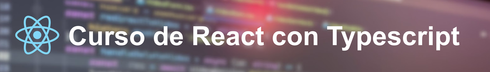

# Curso de React con Typescript en español 2022
Repositorio del curso de Youtube sobre Curso de React con Typescript en Español.

# Contenidos del curso

A continuación se muestra una lista de los temas que se explican en el curso,
final en tu dispositivo, así como el enlace directo al lugar del repositorio donde puedes encontrar el código fuente de cada aplicación:

## Sección 1: Introducción

- ¿Qué es React?
- TypeScript
- ¿Qué es Frontend?
- Instalación de Node.js en Windows, Mac y Ubuntu
- IDE y Editor de Código para Programar en React

## Sección 2: Creación de nuestra primera aplicación
- Creación de nuestra primera aplicación
- Hola Mundo
- JSX y TSX
- Renderizado de elementos y React DOM

## Sección 3: Componentes
- Creación de un componente
- Componentes de Clase y Funcionales usando Typescript

